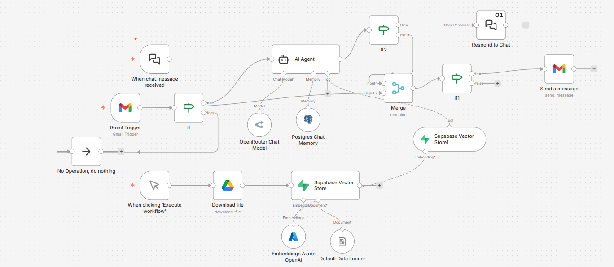

# Nepal AI Policy RAG Agent

## Overview



This project provides an automated Retrieval-Augmented Generation (RAG) workflow for answering questions about Nepal’s National AI Policy. Built with n8n, it integrates document Q&A, vector search, and multi-channel automation to deliver accurate responses via both Gmail and chat interfaces.

## Features

- Automated Q&A: Answers questions about Nepal’s AI Policy using document retrieval and AI generation.
- Multi-Channel Support: Handles queries from both Gmail and chat platforms.
- Vector Search Integration: Uses Supabase vector store for efficient document chunk retrieval.
- Custom Filtering: Only responds to relevant emails and queries based on keywords and sender.

## How It Works

1. **Triggers:**  
   - The workflow is triggered by either a new Gmail message or a chat message.
2. **Filtering:**  
   - Incoming emails are filtered for relevance using subject and content keywords.
   - The workflow excludes emails sent by itself to prevent reply loops.
3. **AI Agent:**  
   - The question or email content is passed to an AI agent, which uses vector search to retrieve relevant document sections and generate a response.
4. **Branching:**  
   - If the trigger is a chat message, the response is sent back via chat.
   - If the trigger is an email, the response is merged with the original email data and sent as a reply via Gmail.
5. **Data Management:**  
   - The workflow uses Supabase for vector storage and Postgres for chat memory, ensuring context-aware and accurate answers.

## Getting Started

1. **Clone the Repository:**  
   ```
   git clone https://github.com/yourusername/Nepal-AI-Policy-Rag.git
   ```

2. **Import the Workflow:**  
   - Open n8n and import the provided workflow JSON file.

3. **Configure Credentials:**  
   - Set up your Gmail, Supabase, and Postgres credentials in n8n.

4. **Deploy and Test:**  
   - Activate the workflow and test by sending relevant emails or chat messages.

## What is RAG?

Retrieval-Augmented Generation (RAG) is an AI technique that combines information retrieval with generative models. It retrieves relevant document chunks from a knowledge base and uses them to generate accurate, context-aware responses. This approach is especially useful for answering questions based on large or complex documents, such as policy papers.
